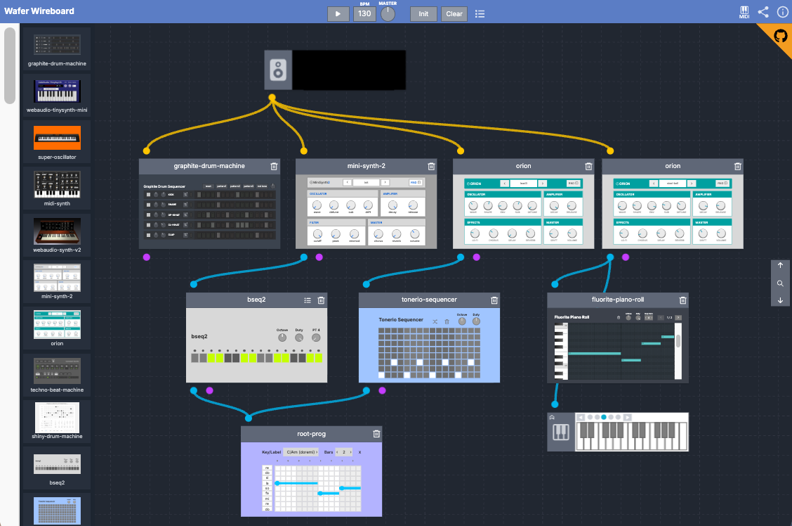

# Wafer Wireboard



Wafer Wireboard is a host app that lets you connect Web Audio apps as nodes and play them together.

This app was built as a demonstration for `Wafer`, a plugin platform for Web Audio.

The setup involves connecting small modules—such as synthesizers, sequencers, and effects units—to play sounds and create music. We call these small modules units.

Place units on the board, connect them, and send audio through the graph to hear how the framework works. It includes several my original units, along with units based on existing open-source web apps.

## Technical Stack

- React
- Typescript
- Twind
- Vite
- Wafer
- Wafer Vite Plugin

This is a frontend-only project and you can easily reproduce.

## Build and run

```
  pnpm install
```

```
  pnpm run dev
```

For the first run, the vite plugin for wafer downloads units declared in `src/unit-source-urls.ts` and generate catalog json.

## License

This project is licensed under MIT.

## References

### Wafer

The plugin platform, core of the host system.

[https://github.com/yahiro07/wafer](https://github.com/yahiro07/wafer)

### wafer-units

Repository for my own designed units.

[https://github.com/yahiro07/wafer-units](https://github.com/yahiro07/wafer-units)

### wafer-custom-units

Repository for existing OSS web app based units. Forked and arranged to run on Wafer.

[https://github.com/yahiro07/wafer-custom-units](https://github.com/yahiro07/wafer-custom-units)
